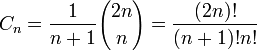

# 出栈顺序

- **关键词**：堆栈应用、递归

已知一个入栈序列为1,2,3,4,5，求所有可能的出栈序列总数有多少？

这个时候就出现了在组合数学中的概念--卡塔兰数。



## 问题描述

输入一个入栈序列，输出所有可能的出栈序列？

## 算法思路

每次操作只有两种选项，

1. 输入的元素压栈；
2. 栈顶的元素出栈；

后一次操作不受前一次操作影响。故可以使用递归实现。递归终止条件即输入序列用完。

## 代码实现

C++代码实现如下

```c++
void print_queue(queue<int> q);

void func(queue<int> in, stack<int> st, queue<int> r, bool doPush)
{
    if ( in.empty() ) {   // 结束条件
        if (doPush) return; // 入栈队列空了，再push不合理
        while ( !st.empty() )
        {
            r.push(st.top());
            st.pop();
        }
        print_queue(r);// 打印输出序列
        return ;
    } else {
        if (doPush) {   // 入栈
            st.push(in.front());
            in.pop();
        } else {        // 出栈 
            if (st.empty()) return ;// 栈是空，直接返回
            r.push(st.top());
            st.pop();
        }
        func(in, st, r, false);
        func(in, st, r, true);
    }
}
```